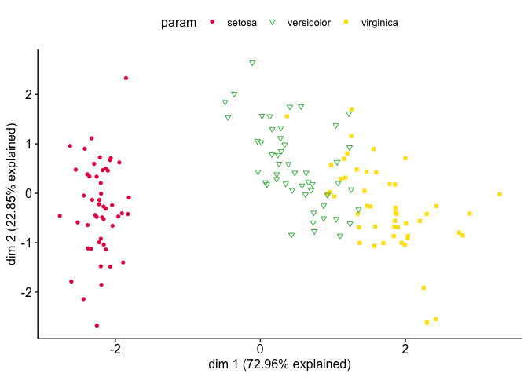
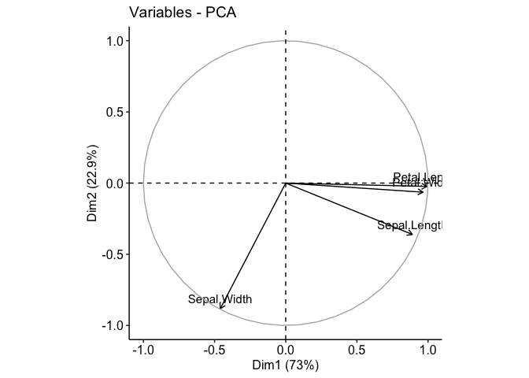
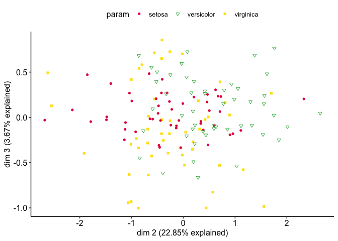
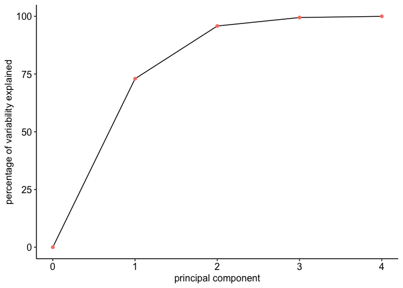
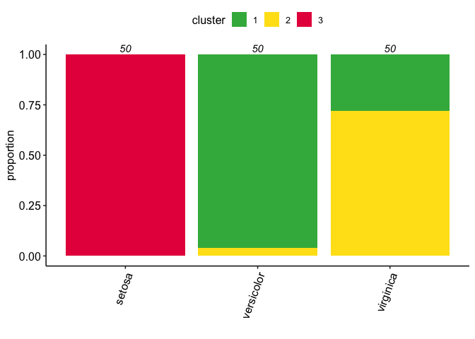
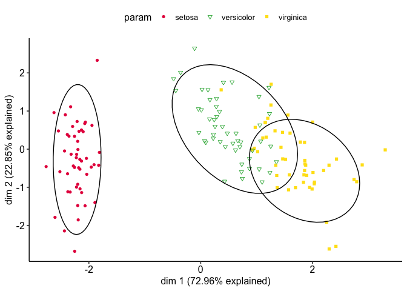

<!-- README.md is generated from README.Rmd. Please edit that file -->

# UnsupLearnR

<!-- badges: start -->
<!-- badges: end -->

The goal of UnsupLearnR is to assist with unsupervised learning in R -
particularly with visualisation.

## Installation

You can install the development version of UnsupLearnR like so:

``` r
# FILL THIS IN! HOW CAN PEOPLE INSTALL YOUR DEV PACKAGE?
```

## Example

I will use the iris data as a demonstration

PCA

``` r
library(UnsupLearnR)
library(dplyr)
#> 
#> Attaching package: 'dplyr'
#> The following objects are masked from 'package:stats':
#> 
#>     filter, lag
#> The following objects are masked from 'package:base':
#> 
#>     intersect, setdiff, setequal, union
library(stats)
library(factoextra)
#> Loading required package: ggplot2
#> Welcome! Want to learn more? See two factoextra-related books at https://goo.gl/ve3WBa

data(iris)

# let's briefly have a look at the iris data
head(iris)
#>   Sepal.Length Sepal.Width Petal.Length Petal.Width Species
#> 1          5.1         3.5          1.4         0.2  setosa
#> 2          4.9         3.0          1.4         0.2  setosa
#> 3          4.7         3.2          1.3         0.2  setosa
#> 4          4.6         3.1          1.5         0.2  setosa
#> 5          5.0         3.6          1.4         0.2  setosa
#> 6          5.4         3.9          1.7         0.4  setosa

# let's do a PCA on Sepal.Length, Sepal.Width and Petal.Length (ie leave out species)
iris_numeric = select(iris, -c(Species))

## performing PCA, 
## the `scale. = T` option scales your data to standard normal distribution (mean=0, var=1) - this is generally recommended as the categories on PCA are not on the same units/scales
pca = prcomp(iris_numeric, scale. = T)
pca_ed = as.data.frame(pca$x)

# let's colour the PCA plot by iris species
# first create a param dataframe - the column to be coloured has to be named "param"
params = data.frame(param=iris$Species)

plot_pca(pca_ed, params = params)
```



``` r

# it's worth looking at the loadings plot, let's use fviz_pca_var from factoextra package (I think it does a really good job so I don't think I need to write a similar function in UnsupLearnR)
fviz_pca_var(pca)
```



``` r

# you can also choose the dimensions (principle components) on the x and y axis 
plot_pca(pca_ed, param = params, x = 2, y= 3)
```



``` r

# now PCA preserves the number of dimensions, as we start with 4 variables (columns), we should now have 4 principle components 
# how do you know how many dimensions to look at? let's check the scree plot (we should have done this before even looking at the pca plots themselves)
# The scree plot shows that the first 2 dimensions already captured almost 100% of the variation (ie information) of the data - 
# so looking at the last 2 dimensions won't add much ore values
scree_plot(pca_ed)
```



UnsupLearnR also helps with clustering - note that this is designed for
the function in the `stats` package

``` r
# let's do kmeans clustering
# let's set K=3 (because it's quite obvious on the pca plot), # let's use 30 initialisations because the first step of kmeans is a randomisation step
# and set a limit to the number of iterations at 20
k = 3
set.seed(2510)
cluster = make_cluster(iris_numeric, clusterFUN = kmeans, centers = k, nstart = 30, iter.max = 20)
set.seed(NULL)

# now that we have the cluster object, let's see how species are assigned to clusters
plot_labelled_cluster_bars(cluster = cluster, param = params)
```



``` r

# and map the clustering result to the PCA plot

plot_pca(pca_ed, params, cluster = cluster)
```



What if it’s unclear how many K clusters to choose? Let’s examine a
range

``` r
library(ggplot2)
set.seed(2510)

n_clusters = 15
clusters = list()
for (i in 1:n_clusters) {
  clusters[[i]] = make_cluster(iris_numeric, kmeans, centers = i, nstart = 30, iter.max = 20)
}
set.seed(NULL)

# let's look at the total variation within clusters plots 
# total variation within clusters measures how far away datapoints are from their centers
# as K increases, it always decreases
# A good K is one where you see a kink
# here the decrease from 3 to 4 is tiny compared to 2 to 3, suggesting that 3 is a good K value
tot_within_var_plot(clusters = clusters) + 
  scale_x_continuous(n.breaks = n_clusters)
```


